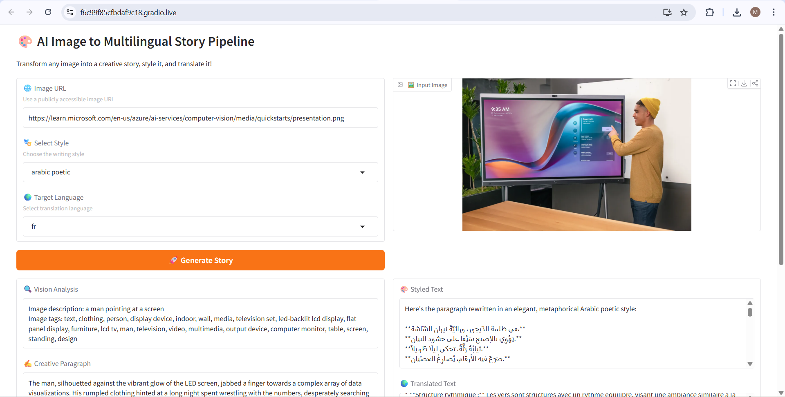
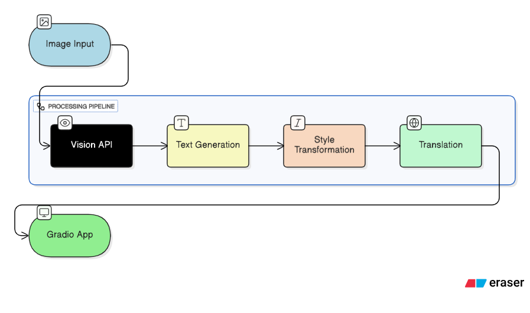

# AI-Image-to-Story-Pipeline

## Overview
The **AI-Image-to-Story Pipeline** is an end-to-end system that transforms an input image into a creatively generated, styled, and translated story, displayed via a web interface. This project demonstrates the integration of vision AI, natural language generation, style transfer, translation, and interactive deployment with Gradio.

The pipeline enables users to upload an image, automatically generate descriptive text, apply creative style transformations, translate it into multiple languages, and interact with the output through a simple web app.

## Tech Stack
- **Azure Computer Vision** – for image understanding and object detection  
- **Azure Translator** – for multilingual translation  
- **Hugging Face Transformers** – for creative text generation and style adaptation  
- **Prompt Engineering** – to guide text generation  
- **Python** – core programming language  
- **Gradio** – interactive web interface  
- **Azure Machine Learning Studio (Notebooks)** – development and testing environment  

## Pipeline Diagram
The flow of the pipeline:

Image → Vision API → Text Generation → Style Transformation → Translation → Gradio App

markdown
Copy code

## Features
- **Image Understanding** – extract semantic information from uploaded images  
- **Creative Text Generation** – generate descriptive and engaging stories from images  
- **Style Transformation** – apply customized text styles using fine-tuning techniques  
- **Multilingual Output** – translate stories into multiple languages  
- **Web Interface Demo** – deploy and interact with the pipeline via Gradio  

## Project Structure
AI-Image-to-Story-Pipeline/
│
├── README.md
├── assets/
│ ├── sample_image.jpg
│ └── pipeline_diagram.png
│
├── outputs/
│ ├── vision_summary.txt
│ ├── creative_generation.txt
│ ├── styled_output.txt
│ ├── translated_output.txt
│ └── gradio_interface_screenshot.png
│
└── app/
└── gradio_app_preview.png

markdown
Copy code

## Screenshots & Sample Outputs
- **Vision API Summary:** `outputs/vision_summary.txt`  
- **Creative Story Generation:** `outputs/creative_generation.txt`  
- **Styled Story Output:** `outputs/styled_output.txt`  
- **Translated Output:** `outputs/translated_output.txt`  
- **Gradio App Preview:** `app/gradio_app_preview.png`  
- **Interface Screenshot:** `outputs/gradio_interface_screenshot.png`  

## Usage
1. Clone the repository.  
2. Install required Python packages:  
  pip install -r requirements.txt
3. Run the Gradio app:
  python app/gradio_app.py
4. Upload an image and explore the generated multilingual story outputs.

